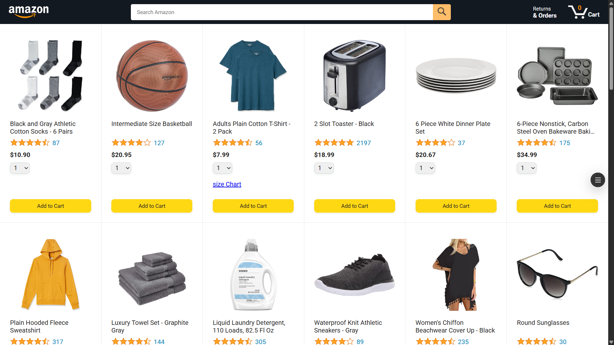
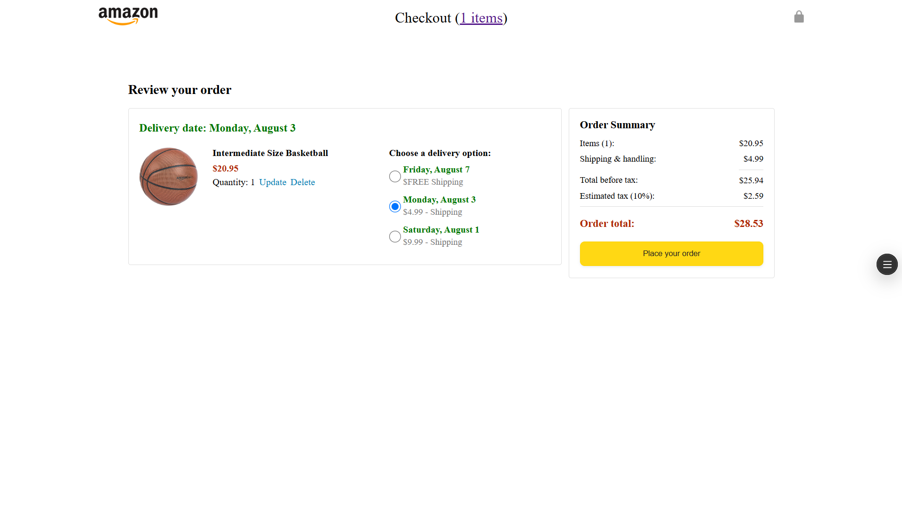
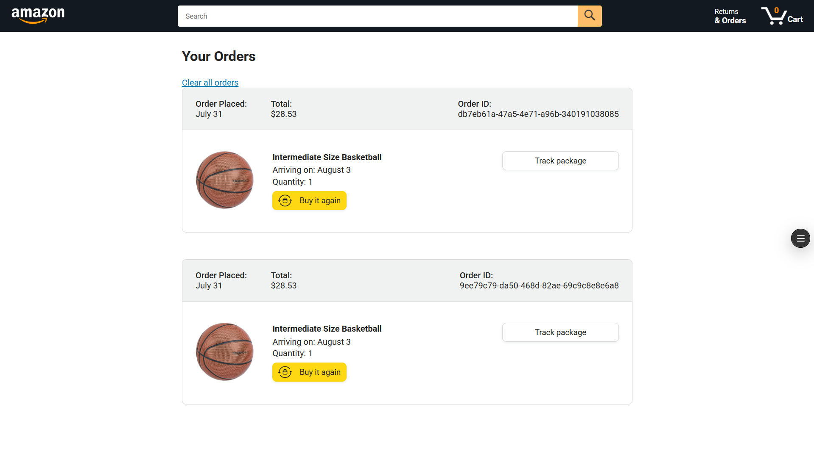
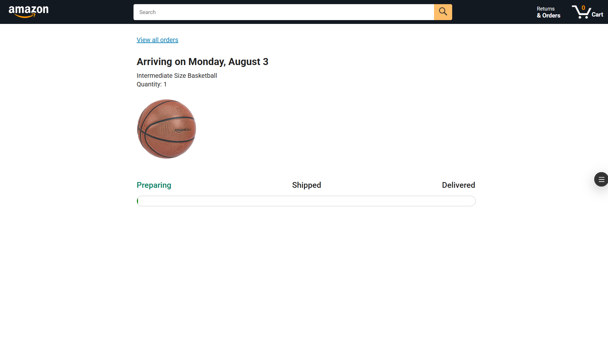

# 🛒 Amazon Clone

A multi-page Amazon e-commerce clone built with vanilla JavaScript, HTML, and CSS.

🔗 **Live Demo:** [amazon-clone-rho-orpin.vercel.app](https://amazon-clone-rho-orpin.vercel.app)

---

## 📸 Preview

| Page | Preview |
|------|---------|
| Home |  |
| Checkout |  |
| Orders |  |
| Tracking |  |

---

## 📄 Pages

### 🏠 Home (`amazon.html`)
- Product grid with product name, star ratings, review count, and price
- Quantity selector dropdown per product
- **Add to Cart** button for each product
- Search bar and cart count in the header
- Size chart link on applicable products (e.g. clothing)

### 💳 Checkout (`checkout.html`)
- Shows item image, name, price, and quantity
- **Update** and **Delete** controls per item
- 3 delivery options per item (e.g. free standard, paid expedited, paid priority) with dates and costs
- **Order Summary** panel showing: Items total, Shipping & handling, Total before tax, Estimated tax (10%), and Order total
- **Place your order** button

### 📦 Orders (`orders.html`)
- Shows order date, total cost, and a unique Order ID per order
- Per item: product image, name, arriving date, quantity
- **Buy it again** button
- **Track package** button
- **Clear all orders** link at the top

### 🚚 Tracking (`tracking.html`)
- Shows arriving date, product name, quantity, and product image
- Visual progress bar with 3 stages: **Preparing → Shipped → Delivered**
- **View all orders** link back to orders page

---

## 🗂️ Project Structure

```
amazon-clone/
│
├── amazon.html
├── checkout.html
├── orders.html
├── tracking.html
│
├── data/
│   ├── cart.js
│   ├── deliveryOptions.js
│   └── products.js
│
├── scripts/
│   ├── amazon.js
│   ├── checkout.js
│   ├── checkout/
│   │   ├── orderSummary.js
│   │   └── paymentSummary.js
│   └── utils/
│       └── money.js
│
├── styles/
│   ├── amazon.css
│   ├── body.css
│   ├── checkout.css
│   ├── general.css
│   ├── header.css
│   ├── orders.css
│   └── tracking.css
│
├── images/
│   ├── products/
│   │   └── variations/
│   ├── icons/
│   ├── ratings/
│   └── preview/
│       ├── home.png
│       ├── checkout.png
│       ├── order.png
│       └── tracking.png
│
└── tests-jasmine/
    ├── tests.html
    ├── data/
    │   └── cartTest.js
    └── utils/
        └── moneyTest.js
```

---

## 🛠️ Tech Stack

- **HTML5** — Page structure
- **CSS3** — Styling and layout
- **JavaScript (ES6+)** — Dynamic rendering, cart logic, DOM manipulation
- **Jasmine** — Unit testing

---

## ⚙️ Getting Started

1. **Clone the repository**
   ```bash
   git clone https://github.com/Mr-SK534/Amazon_clone
   cd amazon-clone
   ```

2. **Open in browser**

   No build step needed. Open `amazon.html` directly in your browser, or use the VS Code Live Server extension.

3. **Run Tests**

   Open `tests-jasmine/tests.html` in your browser to run the Jasmine test suite.

---

## 🧪 Tests

Unit tests written with **Jasmine 5.1.1** covering:
- `cartTest.js` — Cart operations
- `moneyTest.js` — Money/currency formatting utility

---

## 🙌 Acknowledgements

- Inspired by [Amazon.com](https://www.amazon.com)
- Deployed on [Vercel](https://amazon-clone-rho-orpin.vercel.app/)